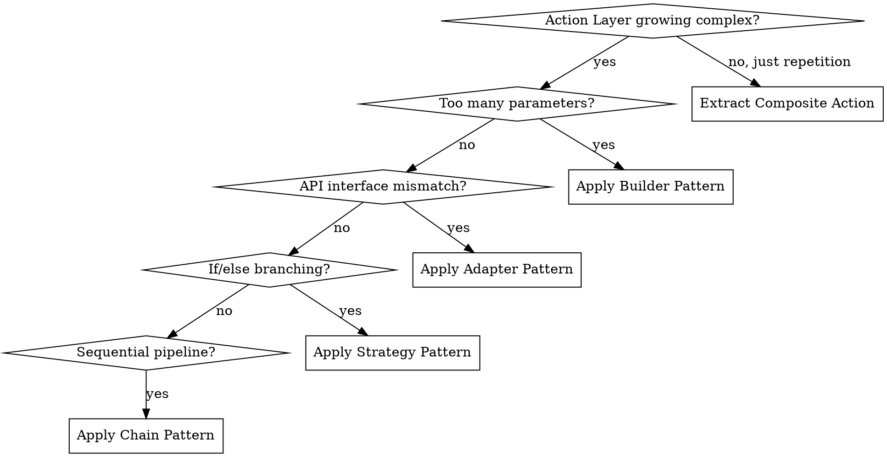

# DAA Framework Architect

**REQUIRED BACKGROUND:** You MUST understand `daa:daa-core` before using this skill.

## Overview

Use this skill when starting a new E2E automation project, restructuring an existing test suite, or scaling an automation framework. It provides project structure templates and advanced patterns for growing test suites.

## When to Use

- **New project**: Scaffolding directory structure for a DAA-compliant framework
- **Migration**: Converting POM or flat scripts to DAA three-layer architecture
- **Scaling**: Test suite growing from 50 → 500+ scenarios; need structured abstraction

## Project Scaffold

A DAA-compliant project separates the three layers in the directory structure:

```
project/
├── lib/                          # Framework code (Action + Physical layers)
│   ├── api/                      # API testing support
│   │   ├── action_layer.py       # Action Layer: API business actions
│   │   └── physical_layer.py     # Physical Layer: HTTP client wrapper
│   ├── web/                      # Web/UI testing support
│   │   ├── action_layer.py       # Action Layer: UI business actions
│   │   ├── physical_layer.py     # Physical Layer: browser driver wrapper
│   │   └── constants.py          # UI selectors and URLs
│   └── __init__.py
├── tests/                        # Test Layer
│   ├── api/
│   │   ├── test_crud.py          # API test scenarios
│   │   └── test_workflows.py     # API composite workflow tests
│   ├── web/
│   │   └── test_search.py        # Web test scenarios
│   └── conftest.py               # Test fixtures and configuration
├── config/                       # Environment configuration
├── requirements.txt              # Dependencies
└── README.md
```

→ Full template with explanations: `project-scaffold.md`

## Scaling Decision Tree

When Action Layer complexity grows, apply the appropriate design pattern:



→ Full pattern details: `scaling-patterns.md`

## Technology-Agnostic Design Checklist

Before finalizing a framework design, verify:

- [ ] **Three layers clearly separated** in directory structure (not mixed in one folder)
- [ ] **Physical Layer is swappable** — can change from Selenium to Playwright by replacing only Physical Layer files
- [ ] **Action Layer is test-framework agnostic** — actions work regardless of pytest, JUnit, TestNG, etc.
- [ ] **Selectors are centralized** — UI selectors live in a constants file, not scattered across code
- [ ] **Fixtures/setup are isolated** — test configuration (conftest, base classes) doesn't contain business logic
- [ ] **Dependencies flow downward** — Test → Action → Physical, never upward

## Migration from Page Object Model

When converting existing POM code to DAA:

1. **Identify** selectors/locators in Page Objects → move to Physical Layer (or constants)
2. **Extract** business logic and assertions from Page Objects → move to Action Layer
3. **Simplify** test files to pure declarative calls → Test Layer
4. **Verify** no test file imports Page Objects or Physical Layer directly
5. **Add** self-verification to every Action method (the step most POM code is missing)
