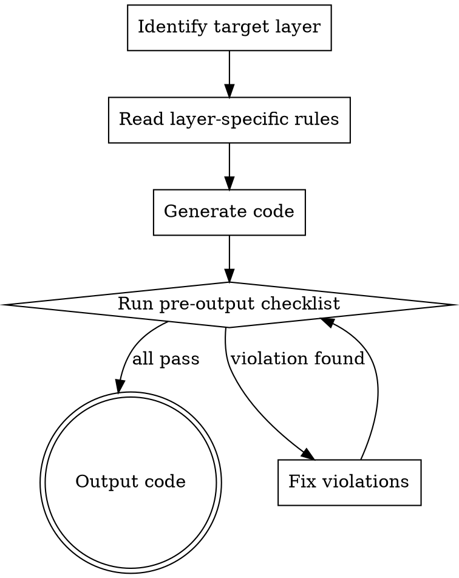

# DAA Code Generator

**REQUIRED BACKGROUND:** You MUST understand `daa:daa-core` before using this skill.

## Overview

When generating E2E test automation code, follow the Declarative Action Architecture strictly. Every piece of code you write belongs to exactly ONE of the three layers, and must follow that layer's rules.

## Generation Process



## Quick Rules Per Layer

### Test Layer

- **ZERO logic**: No `if`, `for`, `while`, `try/catch`
- **ZERO assertions**: All verification is inside Action methods
- **ZERO direct calls**: No HTTP requests, no WebDriver, no database
- Test methods call ONLY Action Layer methods
- Test class inherits from or composes the Action Layer

```
// Test Layer — pure declarative
test_guest_checkout_journey():
    navigate_to_home_and_verify_title()
    search_for_product_and_verify_results_not_empty("MacBook Air")
    add_first_result_to_cart_and_verify_toast()
    navigate_to_cart_and_verify_page()
    click_checkout_and_verify_login_prompt()
```

→ Full generation rules: `test-layer.md`

### Action Layer

- Every method MUST self-verify (built-in assertion)
- Delegates system interaction to Physical Layer — no direct calls
- **Atomic Actions** (Level 1): single operation + verify
- **Composite Actions** (Level 2): orchestrate multiple Atomics
- Use semantic long names: `verb_object_and_verify_outcome`

```
// Atomic Action
search_for_product_and_verify_results_not_empty(keyword):
    physical.fill(SEARCH_INPUT, keyword)
    physical.click(SEARCH_BUTTON)
    physical.wait_for(RESULT_SLOT)
    count = physical.get_count(RESULT_ITEM)
    assert count > 0, f"Expected >0 results for '{keyword}', got {count}"

// Composite Action
complete_checkout_and_verify_order(product, payment):
    search_for_product_and_verify_results_not_empty(product)    // Atomic
    add_first_result_to_cart_and_verify_toast()                  // Atomic
    navigate_to_cart_and_verify_page()                           // Atomic
    submit_payment_and_verify_success(payment)                   // Atomic
    assert order_confirmation_is_visible()                       // Composite verify
```

→ Full generation rules: `action-layer.md`

### Physical Layer

- **Pure execution**: No assertions, no business logic
- Thin wrapper around underlying library
- One method per primitive operation

```
// Physical Layer — dumb driver
fill(selector, text):
    driver.find(selector).fill(text)

click(selector):
    driver.find(selector).click()

get(url, params=None):
    return http_client.get(url, params=params)
```

→ Full generation rules: `physical-layer.md`

## Pre-Output Checklist

Before outputting ANY generated test code, verify ALL items:

- [ ] **Test Layer has ZERO logic?** No if/for/while/try, no raw system calls, no assertions
- [ ] **Every Action self-verifies?** Every action method contains at least one assertion
- [ ] **Physical Layer has ZERO assertions?** No assert, no business decisions
- [ ] **Naming follows semantic convention?** `verb_object_and_verify_outcome` pattern
- [ ] **Composite Actions compose Atomics?** Level 2 calls Level 1, not Physical Layer directly
- [ ] **Layers don't skip?** Test → Action → Physical (never Test → Physical)

If ANY item fails, fix the code before outputting.
