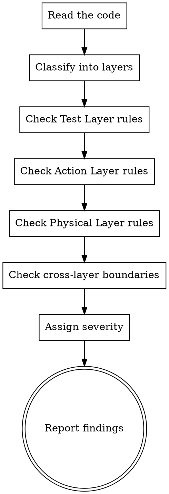

# DAA Code Reviewer

**REQUIRED BACKGROUND:** You MUST understand `daa:daa-core` before using this skill.

## Overview

Review automation test code against DAA principles. Classify each violation by severity and provide actionable fix suggestions.

## Review Process

## Quick Review Checklist (Top 10)

Run through these checks in order. Stop and flag immediately on any CRITICAL finding.

### Test Layer

1. **[CRITICAL]** Does any test method contain `if`, `for`, `while`, or `try/catch`?
2. **[CRITICAL]** Does any test method make direct API/UI/DB calls (bypassing Action Layer)?
3. **[WARNING]** Does any test method contain `assert` statements (should be in Action Layer)?

### Action Layer

4. **[CRITICAL]** Does any action method lack self-verification (no assertion after operation)?
5. **[CRITICAL]** Does any action method call the underlying library directly (bypassing Physical Layer)?
6. **[WARNING]** Are there Composite Actions that call Physical Layer directly instead of composing Atomics?
7. **[WARNING]** Do action names follow the `verb_object_and_verify_outcome` pattern?

### Physical Layer

8. **[CRITICAL]** Does the Physical Layer contain any assertions or business logic?
9. **[WARNING]** Does any Physical Layer method perform multiple operations instead of one?

### Cross-Layer

10. **[CRITICAL]** Does any layer skip the adjacent layer (e.g., Test → Physical directly)?

→ Full detailed checklist: `checklist.md`

## Severity Classification

| Level | Meaning | Action Required |
|-------|---------|-----------------|
| **CRITICAL** | Breaks DAA fundamentals — causes false positives or destroys test trust | Must fix before merge |
| **WARNING** | Hurts maintainability or violates DAA best practices | Should fix; acceptable to defer with justification |
| **SUGGESTION** | Improvement opportunity for readability or consistency | Nice to have; fix when convenient |

→ Full severity guide with examples: `severity-guide.md`

## Report Format

Every report MUST start with a **DAA Score** (1-10, where 10 = full compliance). Score is calculated by deducting from 10 based on findings severity.

→ Full scoring rubric, rules, and report template: `scoring.md`

## Common Patterns to Watch For

1. **"It works so it's fine"**: Code that passes tests but violates DAA is technical debt that will cause false positives later
2. **Gradual erosion**: One `if` in a test method → two → tests become procedural scripts
3. **"Just this once"**: Direct Physical Layer calls in tests "just for this special case" — there are no exceptions
4. **Assertion-free actions**: Methods named `click_save()` without `_and_verify_*` suffix — likely missing verification
